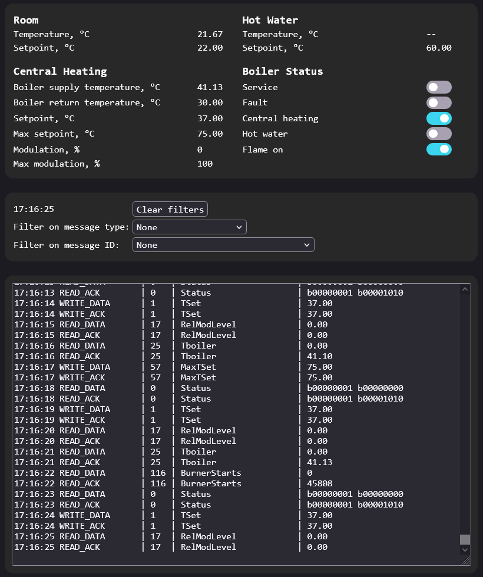

# opentherm-gateway-simple

A simple example of using OpenTherm gateway to monitor and/or override heating status commands.
For details see https://diyless.com/blog/opentherm-gateway-sample

Forked from https://github.com/diyless/opentherm-gateway-simple and modified as follows:

* Project file structure changed from `Arduino IDE` to `PlatformIO / VSCode IDE`
* `Functionality` Enabled over-the-air (OTA) firmware updates via `http://.../update`
* `Functionality` Added a boiler communication timeout check. It will email an alert and reset the ESP.
* `Interface` Neater log using human-readable values
* `Interface` Added more read-outs to the webpage and ThingSpeak
* `Interface` Dark theme
* `Code` Refactored variable names to mimic OpenTherm protocol
* `Code` Cleaned up redundant code
* `Code` Using character arrays in favor of Strings
* `Code` Added precompiler flag to disable the `disable CH` and `disable DHW` manual overrides
* `Code` Added explanatory comments
* `Fix` Report correct `Flame` status
* `Fix` Sporadic ESP32 hangs. Solved by giving tiny idle time to the ESP task manager.

